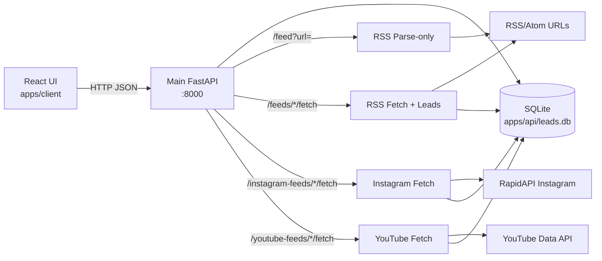

# Data Flow Map

This document explains how data moves through the UI, APIs, microservices, and storage.
It is detailed but intentionally simple to scan.

## High-level graph

Notes:
- The main API exposes `/subreddits` and serves on port 8000.
- The main API uses the SQLite database at `apps/api/leads.db`.

## Services and entrypoints (dev)

- Main API: `apps/api/app/main.py` on `http://localhost:8000`
- Frontend: `apps/client` on `http://localhost:5173`

## Shared data stores

- SQLite DB: `apps/api/leads.db`
  - Schema created by `apps/api/lib/database/init_db.py`.
  - Used by the main API.

## Frontend data flow

Frontend code lives in `apps/client`.
The API client is `apps/client/src/api.js` with `API_BASE = http://localhost:8000`.

### Dashboard page (`apps/client/src/pages/Dashboard.jsx`)
1) UI calls `GET /categories`, `GET /feeds`, `GET /tags`, and `GET /leads?limit=1`.
2) Backend returns counts; UI calculates summary stats.
3) UI displays counts and navigation links.

### Feeds page (`apps/client/src/pages/Feeds.jsx`)
1) UI loads feeds, categories, and tags.
2) Create/edit feed -> `POST /feeds` or `PUT /feeds/{id}`.
3) Toggle active -> `PATCH /feeds/{id}/activate|deactivate`.
4) Fetch now -> `POST /feeds/{id}/fetch` or `POST /feeds/fetch-all`.

### Instagram feeds/posts (`apps/client/src/pages/InstagramFeeds.jsx`)
1) UI loads feeds -> `GET /instagram-feeds`.
2) Create/edit -> `POST /instagram-feeds` or `PUT /instagram-feeds/{id}`.
3) Fetch now -> `POST /instagram-feeds/{id}/fetch` or `POST /instagram-feeds/fetch-all`.
4) Posts view -> `GET /instagram-feeds/posts`.

### YouTube feeds/posts (`apps/client/src/pages/YouTubeFeeds.jsx`, `apps/client/src/pages/YouTubePosts.jsx`)
1) UI loads feeds -> `GET /youtube-feeds`.
2) Create/edit -> `POST /youtube-feeds` or `PUT /youtube-feeds/{id}`.
3) Fetch now -> `POST /youtube-feeds/{id}/fetch?max_results=5` or `POST /youtube-feeds/fetch-all`.
4) Posts view -> `GET /youtube-feeds/posts`.

### Subreddits (`apps/client/src/pages/Subreddits.jsx`)
1) UI loads subreddits -> `GET /subreddits`.
2) Create/edit -> `POST /subreddits` or `PUT /subreddits/{id}`.
3) Delete -> `DELETE /subreddits/{id}`.

### Categories, Tags, Leads, Logs pages
Each page maps directly to the related REST endpoints in `apps/api/features/*/api/routes.py`.

### Subreddits in UI
Subreddits are managed through `/subreddits`.

## Backend data flow (main API)

### Core DB helpers
All core routes use `apps/api/lib/database/db.py` for SQLite access.

### Categories
Endpoints: `apps/api/features/categories/api/routes.py`
1) UI or API client calls `POST /categories`.
2) Server inserts row into `categories`.
3) Returns `CategoryResponse`.

### Feeds (RSS sources)
Endpoints: `apps/api/features/feeds/api/routes.py`
1) Create feed -> `INSERT INTO feeds` with category validation.
2) Fetch feeds -> `SELECT * FROM feeds` plus tag join via `feed_tag_map`.
3) Activate/deactivate -> updates `feeds.is_active`.

### RSS parsing (no DB write)
Endpoint: `GET /feed?url=...`
1) URL validated in `apps/api/utils/validation.py`.
2) Parsed by `apps/api/features/feed/service/parser.py` (feedparser).
3) Returns metadata + entries without storing to DB.

### RSS fetch -> leads
Endpoint: `POST /feeds/{id}/fetch` and `POST /feeds/fetch-all`
1) Load feed row by id.
2) Parse RSS at `feeds.url`.
3) For each entry, dedupe by `(feed_id, guid)` and insert into `leads`.
4) Update `feeds.last_fetched`.
5) Insert into `fetch_logs` with status and counts.

### Leads
Endpoints: `apps/api/features/leads/api/routes.py`
1) `GET /leads` builds SQL joins for category/tag filters.
2) Results come from the `leads` table plus joins to `feeds`, `categories`,
   and `feed_tag_map` as needed.

### Tags and feed-tag mapping
Endpoints: `apps/api/features/tags/api/routes.py`
1) Tags live in `feed_tags`.
2) Feed associations live in `feed_tag_map`.
3) Bulk update replaces mappings by deleting all and re-inserting.

### Fetch logs
Endpoints: `apps/api/features/fetch_logs/api/routes.py`
1) Logs live in `fetch_logs`.
2) Reads are filtered by feed_id or status, sorted by `fetched_at`.

### Dev cleanup
Endpoints: `apps/api/features/dev/api/routes.py`
1) `DELETE /dev/clear-all` wipes categories, feeds, tags, leads, logs.
2) `DELETE /dev/clear-fetched` wipes leads + logs only.

### Subreddits
Endpoints: `apps/api/features/subreddits/api/routes.py`
1) Validate subreddit inputs in `apps/api/utils/validation.py`.
2) Store list entries in `reddit_feeds`.
3) Read lists and details directly from `reddit_feeds`.

## Instagram flow (main API)

Endpoints: `apps/api/features/instagram_feeds/api/routes.py`

1) Fetch triggered via `POST /instagram-feeds/{id}/fetch` or `/fetch-all`.
2) `fetch_instagram_feed` calls RapidAPI in
   `apps/api/features/instagram_feeds/service/instagram_client.py`.
3) Posts parsed into `InstagramPost` models.
4) Deduped on `instagram_posts.post_id`.
5) Insert into `instagram_posts` and log into `instagram_fetch_logs`.
6) Update `instagram_feeds.last_fetched` and `last_max_id` for pagination.

## YouTube flow (main API)

Endpoints: `apps/api/features/youtube_feeds/api/routes.py`

1) Fetch triggered via `POST /youtube-feeds/{id}/fetch` or `/fetch-all`.
2) `fetch_youtube_feed` calls the YouTube Data API search endpoint.
3) Videos are deduped on `youtube_posts.video_id`.
4) Inserted with `approval_status='approved'` (auto-approved).
5) Logs written to `youtube_fetch_logs`.
6) `youtube_feeds.last_fetched` updated.

## Table map (which feature writes where)

- Categories: `categories`
- RSS feeds: `feeds`, `feed_tag_map`
- RSS leads: `leads`, `fetch_logs`
- Instagram feeds: `instagram_feeds`, `instagram_feed_tag_map`
- Instagram posts/logs: `instagram_posts`, `instagram_fetch_logs`
- YouTube feeds/posts/logs: `youtube_feeds`, `youtube_posts`, `youtube_fetch_logs`
- Subreddits: `reddit_feeds`

## Operational notes

- Fetch intervals are stored in DB but no scheduler exists in code.
  Fetching is manual via API calls or an external cron.
- The UI uses the main API at port 8000.
